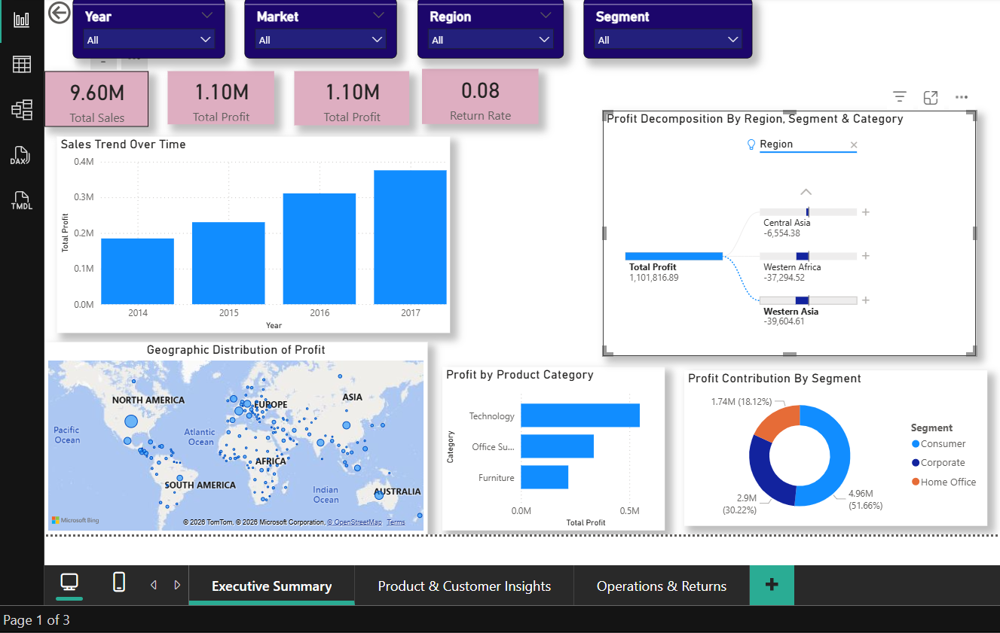
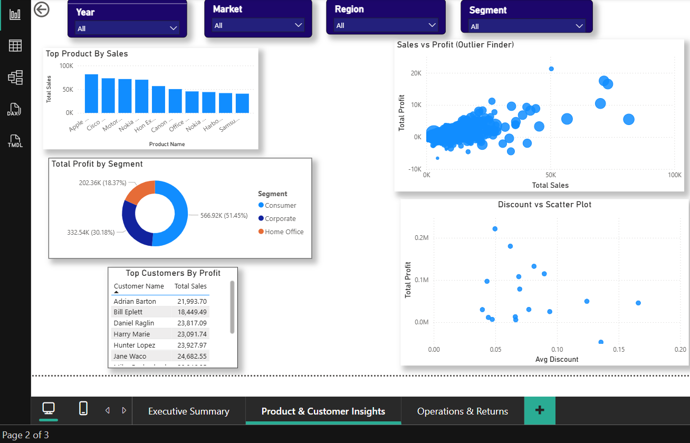
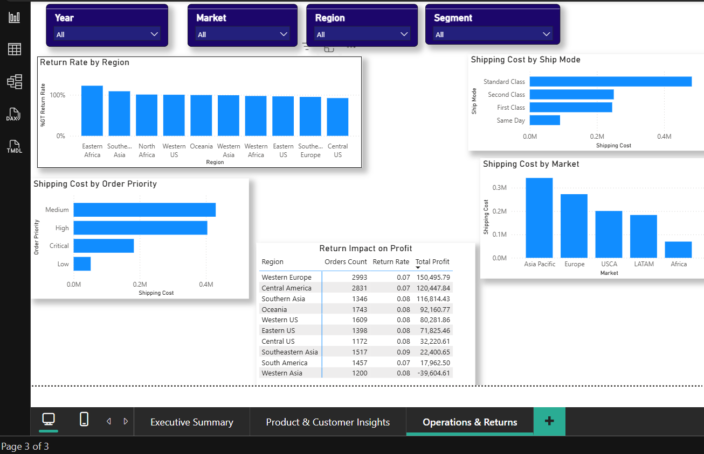

# 📊 Global Superstore Sales & Operations Analysis (Power BI)

## 🚀 Project Overview

This project presents an end-to-end business intelligence analysis of a global retail dataset using Power BI. It is designed to uncover actionable insights across **sales performance, customer behavior, product profitability, and operational efficiency**.

The goal of this analysis is to move beyond raw data and provide **decision-ready insights** that can help stakeholders identify growth opportunities, reduce inefficiencies, and improve overall business performance.

## 🎥 Project Walkthrough (Video)

📌 *Watch the full interactive dashboard walkthrough here:*
👉 **[Insert Loom Video Link Here]**

> This video provides a guided explanation of the dashboard design, data model, key insights, and business recommendations.

## 🎯 Business Objectives

This analysis was guided by the following key questions:

* What are the overall sales and profit trends over time?
* Which products and categories drive the most revenue and profit?
* Who are the most valuable customers, and how do segments differ?
* Where are returns most frequent, and how do they impact profitability?
* What operational factors (e.g., shipping cost, order priority) influence performance?

## 📁 Dataset Description

The project uses the **Global Superstore dataset**, which consists of three primary tables:

* **Orders** – transactional data including sales, profit, discount, and customer/product details
* **Returns** – records of returned orders
* **People** – mapping of regional managers to geographic regions

The dataset enables multi-dimensional analysis across geography, product hierarchy, and customer segmentation.

## 🧱 Data Modeling Approach

A **star schema** data model was implemented to ensure performance, scalability, and analytical clarity.

### 🔹 Fact Table

* `Fact_Orders` – contains transactional metrics such as Sales, Profit, Quantity, Discount, and Shipping Cost

### 🔹 Dimension Tables

* `Dim_Customer` – customer details and segmentation
* `Dim_Product` – product hierarchy (Category, Sub-Category, Product Name)
* `Dim_Geography` – region, market, country, and city
* `Dim_Date` – calendar table for time-based analysis
* `Dim_Returns` – returned orders tracking
* `Dim_People` – regional assignments

This structure enables efficient filtering and supports advanced analytics using DAX.

## 📏 Key Metrics & KPIs

The following measures were created using DAX:

* **Total Sales**
* **Total Profit**
* **Profit Margin**
* **Return Rate**
* **Total Orders**
* **Total Shipping Cost**

These metrics form the foundation of all dashboard insights.

## 📊 Dashboard Structure

The report is organized into three interactive pages:

### 📌 1. Executive Summary

Provides a high-level overview of business performance:

* KPI cards for sales, profit, orders, and return rate
* Sales trend over time
* Profit distribution across categories and segments
* Geographic performance visualization
* Decomposition tree for profit drivers

### 📦 2. Product & Customer Analysis

Focuses on performance at a granular level:

* Top-performing products by sales
* Sales vs profit scatter analysis to identify outliers
* Customer profitability ranking
* Segment contribution to overall profit
* Discount impact on profitability

### 🚚 3. Operations & Returns

Analyzes operational efficiency and risk:

* Return rate by region
* Shipping cost by ship mode and order priority
* Market-level operational cost distribution
* Returns impact on profit

## 🔍 Key Insights

* The **Technology category** is the primary driver of overall profit, outperforming other categories significantly.
* Several products exhibit **high sales but low or negative profit**, indicating potential pricing or discount inefficiencies.
* **Return rates vary across regions**, suggesting operational inconsistencies and potential quality or logistics issues.
* Higher discount levels are strongly associated with **reduced profitability**, highlighting the need for optimized discount strategies.
* A relatively small group of customers contributes disproportionately to total profit, emphasizing the importance of customer segmentation.

## 🛠 Tools & Technologies

* Power BI (Data Visualization & Dashboarding)
* Power Query (Data Cleaning & Transformation)
* DAX (Data Modeling & Calculations)

## 💡 Skills Demonstrated

* Data modeling using star schema principles
* Data transformation and query optimization
* DAX measure creation and KPI design
* Interactive dashboard development
* Business insight generation and storytelling

## 🚀 Future Improvements

* Incorporate shipping duration analysis for deeper operational insights
* Implement forecasting models for sales prediction
* Enhance interactivity with drill-through and advanced tooltips
* Integrate external datasets for richer contextual analysis

## 📥 How to Use

1. Download the `.pbix` file from this repository
2. Open using Microsoft Power BI Desktop
3. Use slicers and filters to explore different business scenarios

## 🤝 Contribution

This project is part of a data analytics portfolio. Feedback, suggestions, and improvements are welcome.

# 🌟 Final Note

This project reflects a complete analytics workflow — from data modeling to insight generation — and demonstrates the ability to translate raw data into meaningful business decisions.
